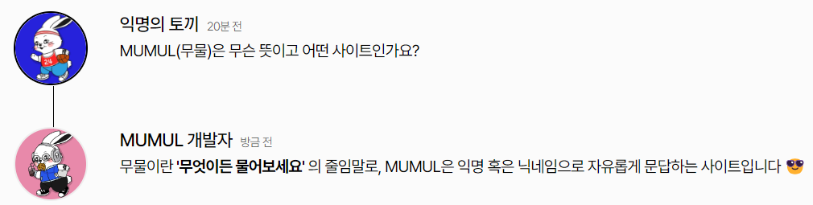
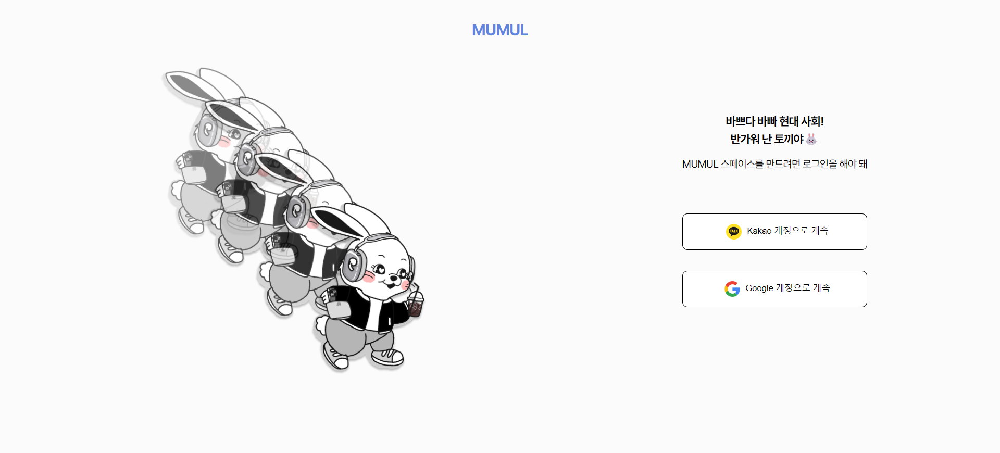
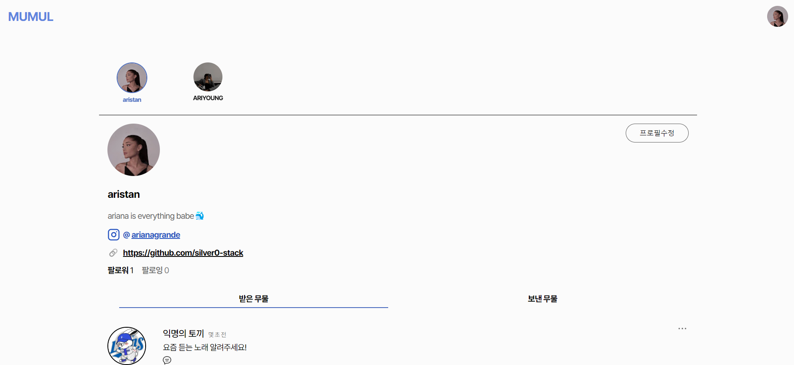
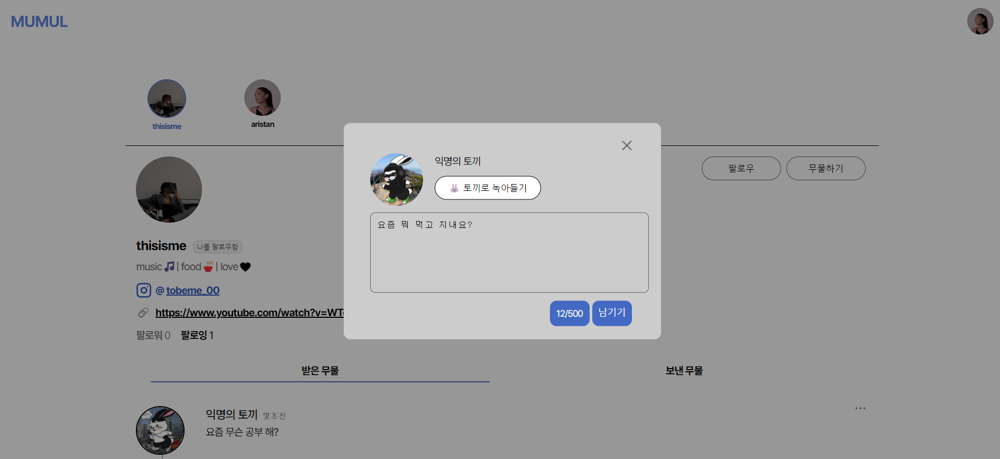
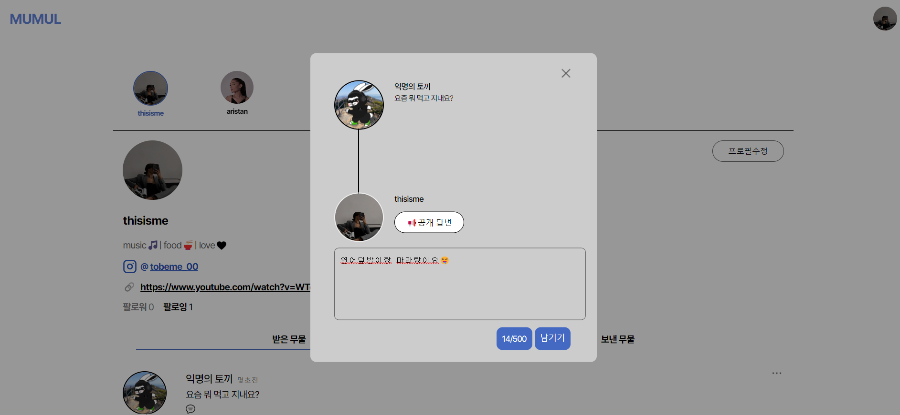
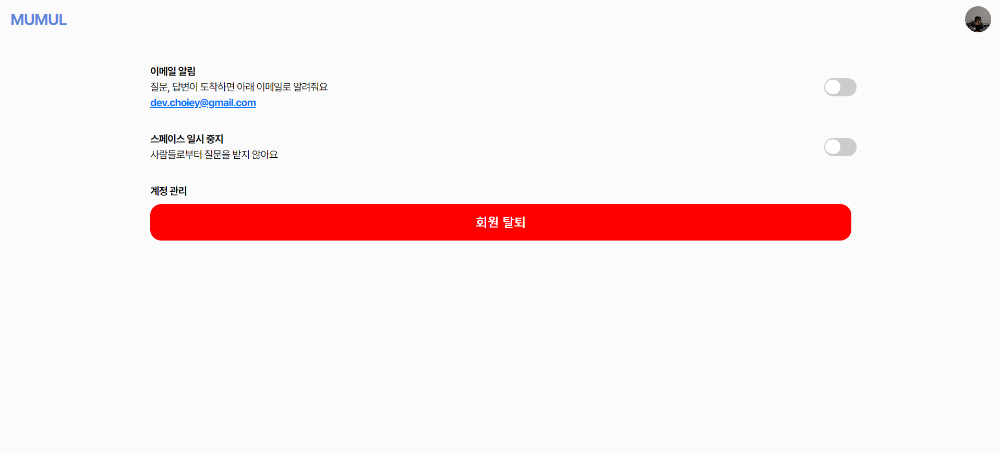

<div align="center">


[](https://hits.seeyoufarm.com)

</div>

# MUMUL
> **서울여자대학교 소프트웨어융합학과 2명의 학부생이 만든 사이드 프로젝트** <br/> **개발기간: 2023.04 ~ 2023.07**

## 배포 주소

> **개발 버전** : [https://mumul.space](https://mumul.space) <br>

## 프론트엔드 리포지토리 주소

> **FrontEnd Repository** : [https://github.com/suucong/mumul_frontend](https://github.com/suucong/mumul_frontend) <br>
## 웹개발팀 소개

|      최은영       |          노수진                                                                                                                           
| :------------------------------------------------------------------------------: | :---------------------------------------------------------------------------------------------------------------------------------------------------: | 
|       |                          |                  
|   [@silver0-stack](https://github.com/silver0-stack)   |    [@suucong](https://github.com/suucong)  | 
| 서울여자대학교 소프트웨어학과 4학년 | 서울여자대학교 소프트웨어학과 3학년 | 

## 프로젝트 소개

서울여자대학교 소프트웨어융합학과 학부생 2명이 제작한 Ask Me Anything(A.K.A AMA) 커뮤니티 서비스입니다. 

MUMUL은 **'사람과 사람을 잇다'** 라는 핵심 가치 아래 개발되었습니다.  누구나 자유롭게 질문함으로써 소통합니다. 개인적인, 공개적인, 전문적인, 비전문적인 것을 가리지 않고 아울러 다루는 [MUMUL 무물(무엇이든 물어보세요)에서 스페이스를 시작하세요](https://mumul.space) ✨

누구나 ```익명의 토끼🐰``` 혹은 ```본인의 닉네임```으로 스페이스에서 자유롭게 질문할 수 있습니다. 그리고 질문받은 자는 ```공개``` 혹은 ```비공개``` 답변(질문자와 답변자만 확인 가능)으로 답변 확인 권한을 선택해서 답변할 수 있습니다.


## 시작 가이드
### Requirements
For building and running the application you need:

- Java 17
- SpringBoot 3.0.5
- Gradle 8.0

### Installation
``` bash
$ git clone https://github.com/suucong/ama_backend.git
```


---

## Stacks 🐈

### Environment


             

### Config
      

### Development


### Communication


---
## 화면 구성 📺
| 메인 페이지  |  로그인 페이지   |
| :-------------------------------------------: | :------------: |
|   |  |  
| 내 스페이스 페이지   |  질문 팝업창   |  
|    |       |
| 답변 팝업창   |  설정 페이지   |  
|    |       |

---
## 주요 기능 📦

### ⭐️ 익명 혹은 본인의 닉네임으로 질문 등록
- ```익명의 토끼🐰``` 와 ```본인 닉네임``` 중 선택해서 스페이스에 질문을 남길 수 있음

### ⭐️ 공개 혹은 비공개 답변 등록
- ```공개 답변```과 ```질문자에게만 공개 답변``` 중 선택해서 질문에 답변을 남길 수 있음

### ⭐️ 팔로우하기
- 팔로우하고 싶은 스페이스를 팔로우 할 수 있음

### ⭐️ 이메일 알림 기능
- 본인 스페이스에 질문 혹은 답변이 달리면 로그인한 이메일로 푸시 이메일 발송

### ⭐️본인 스페이스 중지 기능
- 질문받는 기능, 팔로우 기능 중지
   
---
## 아키텍쳐

### 디렉토리 구조
```bash
│  .gitignore
│  build.gradle
│  gradlew
│  gradlew.bat
│  mumul_intro_.png
│  README.md
│  settings.gradle
│

├─.elasticbeanstalk
│      config.yml
│

├─.gradle
│  │  file-system.probe
│  │

│  ├─8.0
│  │  │  gc.properties
│  │  │

│  │  ├─checksums
│  │  │      checksums.lock
│  │  │      md5-checksums.bin
│  │  │      sha1-checksums.bin
│  │  │
│  │  ├─dependencies-accessors
│  │  │      dependencies-accessors.lock
│  │  │      gc.properties
│  │  │
│  │  ├─executionHistory
│  │  │      executionHistory.bin
│  │  │      executionHistory.lock
│  │  │
│  │  ├─fileChanges
│  │  │      last-build.bin
│  │  │
│  │  ├─fileHashes
│  │  │      fileHashes.bin
│  │  │      fileHashes.lock
│  │  │      resourceHashesCache.bin
│  │  │
│  │  └─vcsMetadata
│  ├─buildOutputCleanup
│  │      buildOutputCleanup.lock
│  │      cache.properties
│  │      outputFiles.bin
│  │
│  └─vcs-1
│          gc.properties
│
├─.idea
│  │  .gitignore
│  │  .name
│  │  compiler.xml
│  │  dbnavigator.xml
│  │  gradle.xml
│  │  jarRepositories.xml
│  │  misc.xml
│  │  vcs.xml
│  │  workspace.xml
│  │
│  └─modules
├─build
│  │  resolvedMainClassName
│  │
│  ├─classes
│  │  └─java
│  │      ├─main
│  │      │  └─com
│  │      │      └─example
│  │      │          └─ama_backend
│  │      │              │  AmaBackendApplication.class
│  │      │              │
│  │      │              ├─config
│  │      │              │  │  JWTRequestFilter.class
│  │      │              │  │  JWTUtils.class
│  │      │              │  │  WebConfig.class
│  │      │              │  │
│  │      │              │  ├─auth
│  │      │              │  │      SecurityConfig.class
│  │      │              │  │

│  │      │              │  └─mail
│  │      │              │          MailConfig.class
│  │      │              │
│  │      │              ├─controller
│  │      │              │      AnswerController.class
│  │      │              │      FollowController.class
│  │      │              │      HealthCheckController.class
│  │      │              │      QuestionController.class
│  │      │              │      SpaceController.class
│  │      │              │      UserController.class
│  │      │              │

│  │      │              ├─dto
│  │      │              │      AnswerDTO$AnswerDTOBuilder.class
│  │      │              │      AnswerDTO.class
│  │      │              │      CodeRequestDto.class
│  │      │              │      FollowingDTO$FollowingDTOBuilder.class
│  │      │              │      FollowingDTO.class
│  │      │              │      IdTokenRequestDto.class
│  │      │              │      QuestionDTO$QuestionDTOBuilder.class
│  │      │              │      QuestionDTO.class
│  │      │              │      ResponseDTO$ResponseDTOBuilder.class
│  │      │              │      ResponseDTO.class
│  │      │              │      TestRequestBodyDTO.class
│  │      │              │      UserUpdateRequestDto$UserUpdateRequestDtoBuilder.class
│  │      │              │      UserUpdateRequestDto.class
│  │      │              │
│  │      │              ├─entity
│  │      │              │      AnswerEntity$AnswerEntityBuilder.class
│  │      │              │      AnswerEntity.class
│  │      │              │      Follow$FollowBuilder.class
│  │      │              │      Follow.class
│  │      │              │      QuestionEntity$QuestionEntityBuilder.class
│  │      │              │      QuestionEntity.class
│  │      │              │      Role.class
│  │      │              │      SpaceEntity$SpaceEntityBuilder.class
│  │      │              │      SpaceEntity.class
│  │      │              │      UserEntity$UserEntityBuilder.class
│  │      │              │      UserEntity.class
│  │      │              │
│  │      │              ├─persistence
│  │      │              │      AnswerRepository.class
│  │      │              │      FollowRepository.class
│  │      │              │      QuestionRepository.class
│  │      │              │      SpaceRepository.class
│  │      │              │      UserRepository.class
│  │      │              │
│  │      │              └─service
│  │      │                      FollowService.class
│  │      │                      MailService.class
│  │      │                      QAService.class
│  │      │                      UserService$1.class
│  │      │                      UserService.class
│  │      │
│  │      └─test
│  │          └─com
│  │              └─example
│  │                  └─ama_backend
│  │                          AmaBackendApplicationTests.class
│  │
│  ├─generated
│  │  └─sources
│  │      ├─annotationProcessor
│  │      │  └─java
│  │      │      ├─main
│  │      │      └─test
│  │      └─headers
│  │          └─java
│  │              ├─main
│  │              └─test
│  ├─libs
│  │      mumul-0.0.1-SNAPSHOT-plain.jar
│  │      mumul-0.0.1-SNAPSHOT.jar
│  │
│  ├─reports
│  │  └─tests
│  │      └─test
│  │          │  index.html
│  │          │
│  │          ├─classes
│  │          │      com.example.ama_backend.AmaBackendApplicationTests.html
│  │          │
│  │          ├─css
│  │          │      base-style.css
│  │          │      style.css
│  │          │
│  │          ├─js
│  │          │      report.js
│  │          │
│  │          └─packages
│  │                  com.example.ama_backend.html
│  │
│  ├─resources
│  │  └─main
│  │          application-dev.yml
│  │          application-prod.yml
│  │          application.yml
│  │
│  ├─test-results
│  │  └─test
│  │      │  TEST-com.example.ama_backend.AmaBackendApplicationTests.xml
│  │      │
│  │      └─binary
│  │              output.bin
│  │              output.bin.idx
│  │              results.bin
│  │
│  └─tmp
│      ├─bootJar
│      │      MANIFEST.MF
│      │
│      ├─compileJava
│      │  │  previous-compilation-data.bin
│      │  │

│      │  └─compileTransaction
│      │      ├─annotation-output
│      │      ├─compile-output
│      │      │  └─com
│      │      │      └─example
│      │      │          └─ama_backend
│      │      │              ├─config
│      │      │              │  └─auth
│      │      │              ├─controller
│      │      │              ├─dto
│      │      │              ├─entity
│      │      │              ├─persistence
│      │      │              └─service
│      │      ├─header-output
│      │      └─stash-dir
│      │              AnswerController.class.uniqueId6
│      │              AnswerDTO$AnswerDTOBuilder.class.uniqueId13
│      │              AnswerDTO.class.uniqueId8
│      │              AnswerEntity$AnswerEntityBuilder.class.uniqueId4
│      │              AnswerEntity.class.uniqueId10
│      │              AnswerRepository.class.uniqueId15
│      │              QAService.class.uniqueId12
│      │              QuestionController.class.uniqueId5
│      │              QuestionDTO$QuestionDTOBuilder.class.uniqueId9
│      │              QuestionDTO.class.uniqueId14
│      │              QuestionEntity$QuestionEntityBuilder.class.uniqueId3
│      │              QuestionEntity.class.uniqueId1
│      │              QuestionRepository.class.uniqueId2
│      │              UserController.class.uniqueId7
│      │              UserService$1.class.uniqueId11
│      │              UserService.class.uniqueId0
│      │
│      ├─compileTestJava
│      │      previous-compilation-data.bin
│      │
│      ├─jar
│      │      MANIFEST.MF
│      │
│      └─test
├─gradle
│  └─wrapper
│          gradle-wrapper.jar
│          gradle-wrapper.properties
│
└─src
├─main
│  ├─java
│  │  └─com
│  │      └─example
│  │          └─ama_backend
│  │              │  AmaBackendApplication.java
│  │              │
│  │              ├─config
│  │              │  │  JWTRequestFilter.java
│  │              │  │  JWTUtils.java
│  │              │  │  WebConfig.java
│  │              │  │
│  │              │  ├─auth
│  │              │  │      SecurityConfig.java
│  │              │  │
│  │              │  └─mail
│  │              │          MailConfig.java
│  │              │
│  │              ├─controller
│  │              │      AnswerController.java
│  │              │      FollowController.java
│  │              │      HealthCheckController.java
│  │              │      QuestionController.java
│  │              │      SpaceController.java
│  │              │      UserController.java
│  │              │
│  │              ├─dto
│  │              │      AnswerDTO.java
│  │              │      CodeRequestDto.java
│  │              │      FollowingDTO.java
│  │              │      IdTokenRequestDto.java
│  │              │      QuestionDTO.java
│  │              │      ResponseDTO.java
│  │              │      TestRequestBodyDTO.java
│  │              │      UserUpdateRequestDto.java
│  │              │
│  │              ├─entity
│  │              │      AnswerEntity.java
│  │              │      Follow.java
│  │              │      QuestionEntity.java
│  │              │      Role.java
│  │              │      SpaceEntity.java
│  │              │      UserEntity.java
│  │              │
│  │              ├─persistence
│  │              │      AnswerRepository.java
│  │              │      FollowRepository.java
│  │              │      QuestionRepository.java
│  │              │      SpaceRepository.java
│  │              │      UserRepository.java
│  │              │
│  │              └─service
│  │                      FollowService.java
│  │                      MailService.java
│  │                      QAService.java
│  │                      UserService.java
│  │
│  └─resources
│          application-dev.yml
│          application-prod.yml
│
└─test
└─java
└─com
└─example
└─ama_backend
AmaBackendApplicationTests.java

```

<!--
```bash
│  .gitignore
│  build.gradle
│  gradlew
│  gradlew.bat
│  mumul_intro_.png
│  README.md
│  settings.gradle
│

├─.elasticbeanstalk
│      config.yml
│

├─.gradle
│  │  file-system.probe
│  │

│  ├─8.0
│  │  │  gc.properties
│  │  │

│  │  ├─checksums
│  │  │      checksums.lock
│  │  │      md5-checksums.bin
│  │  │      sha1-checksums.bin
│  │  │
│  │  ├─dependencies-accessors
│  │  │      dependencies-accessors.lock
│  │  │      gc.properties
│  │  │
│  │  ├─executionHistory
│  │  │      executionHistory.bin
│  │  │      executionHistory.lock
│  │  │
│  │  ├─fileChanges
│  │  │      last-build.bin
│  │  │
│  │  ├─fileHashes
│  │  │      fileHashes.bin
│  │  │      fileHashes.lock
│  │  │      resourceHashesCache.bin
│  │  │
│  │  └─vcsMetadata
│  ├─buildOutputCleanup
│  │      buildOutputCleanup.lock
│  │      cache.properties
│  │      outputFiles.bin
│  │
│  └─vcs-1
│          gc.properties
│
├─.idea
│  │  .gitignore
│  │  .name
│  │  compiler.xml
│  │  dbnavigator.xml
│  │  gradle.xml
│  │  jarRepositories.xml
│  │  misc.xml
│  │  vcs.xml
│  │  workspace.xml
│  │
│  └─modules
├─build
│  │  resolvedMainClassName
│  │
│  ├─classes
│  │  └─java
│  │      ├─main
│  │      │  └─com
│  │      │      └─example
│  │      │          └─ama_backend
│  │      │              │  AmaBackendApplication.class
│  │      │              │
│  │      │              ├─config
│  │      │              │  │  JWTRequestFilter.class
│  │      │              │  │  JWTUtils.class
│  │      │              │  │  WebConfig.class
│  │      │              │  │
│  │      │              │  ├─auth
│  │      │              │  │      SecurityConfig.class
│  │      │              │  │

│  │      │              │  └─mail
│  │      │              │          MailConfig.class
│  │      │              │
│  │      │              ├─controller
│  │      │              │      AnswerController.class
│  │      │              │      FollowController.class
│  │      │              │      HealthCheckController.class
│  │      │              │      QuestionController.class
│  │      │              │      SpaceController.class
│  │      │              │      UserController.class
│  │      │              │

│  │      │              ├─dto
│  │      │              │      AnswerDTO$AnswerDTOBuilder.class
│  │      │              │      AnswerDTO.class
│  │      │              │      CodeRequestDto.class
│  │      │              │      FollowingDTO$FollowingDTOBuilder.class
│  │      │              │      FollowingDTO.class
│  │      │              │      IdTokenRequestDto.class
│  │      │              │      QuestionDTO$QuestionDTOBuilder.class
│  │      │              │      QuestionDTO.class
│  │      │              │      ResponseDTO$ResponseDTOBuilder.class
│  │      │              │      ResponseDTO.class
│  │      │              │      TestRequestBodyDTO.class
│  │      │              │      UserUpdateRequestDto$UserUpdateRequestDtoBuilder.class
│  │      │              │      UserUpdateRequestDto.class
│  │      │              │
│  │      │              ├─entity
│  │      │              │      AnswerEntity$AnswerEntityBuilder.class
│  │      │              │      AnswerEntity.class
│  │      │              │      Follow$FollowBuilder.class
│  │      │              │      Follow.class
│  │      │              │      QuestionEntity$QuestionEntityBuilder.class
│  │      │              │      QuestionEntity.class
│  │      │              │      Role.class
│  │      │              │      SpaceEntity$SpaceEntityBuilder.class
│  │      │              │      SpaceEntity.class
│  │      │              │      UserEntity$UserEntityBuilder.class
│  │      │              │      UserEntity.class
│  │      │              │
│  │      │              ├─persistence
│  │      │              │      AnswerRepository.class
│  │      │              │      FollowRepository.class
│  │      │              │      QuestionRepository.class
│  │      │              │      SpaceRepository.class
│  │      │              │      UserRepository.class
│  │      │              │
│  │      │              └─service
│  │      │                      FollowService.class
│  │      │                      MailService.class
│  │      │                      QAService.class
│  │      │                      UserService$1.class
│  │      │                      UserService.class
│  │      │
│  │      └─test
│  │          └─com
│  │              └─example
│  │                  └─ama_backend
│  │                          AmaBackendApplicationTests.class
│  │
│  ├─generated
│  │  └─sources
│  │      ├─annotationProcessor
│  │      │  └─java
│  │      │      ├─main
│  │      │      └─test
│  │      └─headers
│  │          └─java
│  │              ├─main
│  │              └─test
│  ├─libs
│  │      mumul-0.0.1-SNAPSHOT-plain.jar
│  │      mumul-0.0.1-SNAPSHOT.jar
│  │
│  ├─reports
│  │  └─tests
│  │      └─test
│  │          │  index.html
│  │          │
│  │          ├─classes
│  │          │      com.example.ama_backend.AmaBackendApplicationTests.html
│  │          │
│  │          ├─css
│  │          │      base-style.css
│  │          │      style.css
│  │          │
│  │          ├─js
│  │          │      report.js
│  │          │
│  │          └─packages
│  │                  com.example.ama_backend.html
│  │
│  ├─resources
│  │  └─main
│  │          application-dev.yml
│  │          application-prod.yml
│  │          application.yml
│  │
│  ├─test-results
│  │  └─test
│  │      │  TEST-com.example.ama_backend.AmaBackendApplicationTests.xml
│  │      │
│  │      └─binary
│  │              output.bin
│  │              output.bin.idx
│  │              results.bin
│  │
│  └─tmp
│      ├─bootJar
│      │      MANIFEST.MF
│      │
│      ├─compileJava
│      │  │  previous-compilation-data.bin
│      │  │

│      │  └─compileTransaction
│      │      ├─annotation-output
│      │      ├─compile-output
│      │      │  └─com
│      │      │      └─example
│      │      │          └─ama_backend
│      │      │              ├─config
│      │      │              │  └─auth
│      │      │              ├─controller
│      │      │              ├─dto
│      │      │              ├─entity
│      │      │              ├─persistence
│      │      │              └─service
│      │      ├─header-output
│      │      └─stash-dir
│      │              AnswerController.class.uniqueId6
│      │              AnswerDTO$AnswerDTOBuilder.class.uniqueId13
│      │              AnswerDTO.class.uniqueId8
│      │              AnswerEntity$AnswerEntityBuilder.class.uniqueId4
│      │              AnswerEntity.class.uniqueId10
│      │              AnswerRepository.class.uniqueId15
│      │              QAService.class.uniqueId12
│      │              QuestionController.class.uniqueId5
│      │              QuestionDTO$QuestionDTOBuilder.class.uniqueId9
│      │              QuestionDTO.class.uniqueId14
│      │              QuestionEntity$QuestionEntityBuilder.class.uniqueId3
│      │              QuestionEntity.class.uniqueId1
│      │              QuestionRepository.class.uniqueId2
│      │              UserController.class.uniqueId7
│      │              UserService$1.class.uniqueId11
│      │              UserService.class.uniqueId0
│      │
│      ├─compileTestJava
│      │      previous-compilation-data.bin
│      │
│      ├─jar
│      │      MANIFEST.MF
│      │
│      └─test
├─gradle
│  └─wrapper
│          gradle-wrapper.jar
│          gradle-wrapper.properties
│
└─src
├─main
│  ├─java
│  │  └─com
│  │      └─example
│  │          └─ama_backend
│  │              │  AmaBackendApplication.java
│  │              │
│  │              ├─config
│  │              │  │  JWTRequestFilter.java
│  │              │  │  JWTUtils.java
│  │              │  │  WebConfig.java
│  │              │  │
│  │              │  ├─auth
│  │              │  │      SecurityConfig.java
│  │              │  │
│  │              │  └─mail
│  │              │          MailConfig.java
│  │              │
│  │              ├─controller
│  │              │      AnswerController.java
│  │              │      FollowController.java
│  │              │      HealthCheckController.java
│  │              │      QuestionController.java
│  │              │      SpaceController.java
│  │              │      UserController.java
│  │              │
│  │              ├─dto
│  │              │      AnswerDTO.java
│  │              │      CodeRequestDto.java
│  │              │      FollowingDTO.java
│  │              │      IdTokenRequestDto.java
│  │              │      QuestionDTO.java
│  │              │      ResponseDTO.java
│  │              │      TestRequestBodyDTO.java
│  │              │      UserUpdateRequestDto.java
│  │              │
│  │              ├─entity
│  │              │      AnswerEntity.java
│  │              │      Follow.java
│  │              │      QuestionEntity.java
│  │              │      Role.java
│  │              │      SpaceEntity.java
│  │              │      UserEntity.java
│  │              │
│  │              ├─persistence
│  │              │      AnswerRepository.java
│  │              │      FollowRepository.java
│  │              │      QuestionRepository.java
│  │              │      SpaceRepository.java
│  │              │      UserRepository.java
│  │              │
│  │              └─service
│  │                      FollowService.java
│  │                      MailService.java
│  │                      QAService.java
│  │                      UserService.java
│  │
│  └─resources
│          application-dev.yml
│          application-prod.yml
│
└─test
└─java
└─com
└─example
└─ama_backend
AmaBackendApplicationTests.java

```
-->
